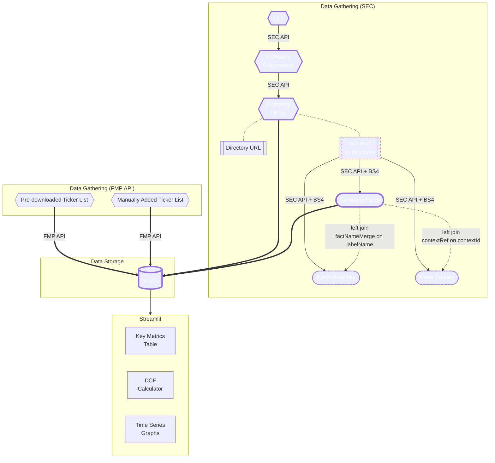

# 🌟 Finance Dashboard: Your Investment Insight Tool

Welcome to the Finance Dashboard, a web application tailored to empower investment enthusiasts by providing financial insights at their fingertips. You can visit the webapp by clicking [here](https://finance-webapp.streamlit.app/Financial_Statements). A second link is also available as a test deployment with Azure App Service - [webapp](https://sec-scraper.azurewebsites.net/SEC_Scraper).

## Table of Contents

- [🌟 Finance Dashboard: Your Investment Insight Tool](#-finance-dashboard-your-investment-insight-tool)
  - [Table of Contents](#table-of-contents)
  - [🚀 Key Highlights](#-key-highlights)
  - [📂 Project Structure](#-project-structure)
  - [🔧 Setup and Launch](#-setup-and-launch)
  - [🛠️ Tools and Libraries](#️-tools-and-libraries)
  - [🎯 Goal of Project](#-goal-of-project)
  - [Action Plan](#action-plan)
  - [📜 Data Acknowledgment](#-data-acknowledgment)
  - [License](#license)
  - [📝 Development Log](#-development-log)

## 🚀 Key Highlights

- **SEC Integration**: Currently fetches data from FMP API but working on directly scraping from SEC EDGAR Database (see more at []())
- **Optimized Data Storage**: Utilizes MongoDB for structured data storage and retrieval, ensuring fast and efficient access.
- **Interactive User Interface**: Designed with Streamlit, the dashboard offers an intuitive experience with dynamic charts and metrics visualization.
- **Intrinsic Value Calculator**: Integrated DCF calculator showcases financial computation capabilities.

## 📂 Project Structure

```
finance-dashboard/
├── .streamlit/
│   ├── config.toml
│   └── secrets.toml
├── pages/
│   ├── 1Financial_Statements.py
│   └── 2SECScraper.py
├── utils/
│   └── database
│       └── _connector.py
│   ├── _utils.py
│   ├── _logger.py
│   ├── _fmpAPI.py
│   ├── _alphavantageAPI.py
│   ├── _mongo.py
│   ├── _sec_page_utils.py
│   └── sec-scraper/
│       ├── sec_class.py
│       ├── sec_scraper_doc.md
│       └── sec_api_test.ipynb
│       ├── _dataclasses.py
│       ├── _mapping.py
│       ├── _utils.py
├── requirements.txt
├── .env
├── .gitignore
├── startup.sh
├── Ticket_List.py
├── LICENSE
└── README.md
```

## 🔧 Setup and Launch

1. **Get the Code**:
   ```bash
   git clone https://github.com/dizzydwarfus/finance-dashboard
   cd finance-dashboard
   ```

2. **Prepare Your Environment**:
   ```bash
   pip install -r requirements.txt
   ```

3. **MongoDB Setup**: Ensure MongoDB is active. Update `.env` with your MongoDB details. 

4. **Engage with the Dashboard**:
   ```bash
   streamlit run Ticker_List.py
   ```


## 🛠️ Tools and Libraries

- **Data Processing:** Pandas
- **Data Scraping:** BeautifulSoup
- **Web Framework:** Streamlit
- **Database:** pymongo
- **Visualization:** plotly

The main core part of the financial data obtained will be from financial APIs at the beginning to get started but will be transitioned to a self-scraped data from [SEC](www.sec.gov) eventually. Refer to [SEC Scraper](./utils/sec-scraper/sec_scraper_doc.md) for more information on scraping from [SEC](www.sec.gov).Several open-source tools/libraries may be used when needed to aid in processing and scraping these data. 

Streamlit will be used as the main open-source app framework for its ease of implementation. I will try to write the codebase in such a way where migration to other web-frameworks would be possible with minimal effort in the future since Streamlit has its limitation.

Plotly is chosen because it works very well with streamlit as opposed to matplotlib. Plotly also offers highly interactive figures that is much more customizable than matplotlib's.


## 🎯 Goal of Project

Besides personal stake in stock/ETF/crypto investing, I have a strong interest for finance. Though not from a Business/Finance educational background, I've self-learned many financial concepts needed to evaluate a company. Merging this knowledge with my passion for programming, I embarked on creating a financial dashboard to aid in investment decisions and to track the financial performance of my investments. While the project can be extensive, my approach is to start simple and iteratively refine and extend its capabilities.


## Action Plan

The development strategy is segmented into:

1. **Data Gathering/Extraction:** Extract data from trusted APIs or scrape data from SEC.
2. **Data Cleaning and Processing:** Ensure data is coherent and transform data as needed (in python).
3. **Data Storage:** Store data to a NoSQL database.
4. **Presented in Streamlit:** Display data in a user-friendly format where key metrics and financial statements summaries are displayed.





## 📜 Data Acknowledgment

All financial data is provided by [Financial Modeling Prep](https://financialmodelingprep.com) and [SEC Edgar Database](https://www.sec.gov/edgar/sec-api-documentation)

## License

Refer to the [LICENSE](./LICENSE) file for more specifics.


## 📝 Development Log

Before 2023-05-30

1. Enabled manual update of ticker list if interested ticker symbol is not in the pre-downloaded list.
2. Use st.secrets so usernames, passwords, API-keys are stored as secrets instead of in local/cloud txt files.
3. Selectable plotly charts. Can pick and choose whichever graph to show from a list of key-graphs. 
4. Instead of directly calling API (slow), first storing information in database (<span style="color:#FF0001;">permitted as long as data not used commercially and not redistributed</span>). This is also a workaround for the limited requests per day allowed for using free version of these APIs. 
5. Introduced DCF calculator - with customizable growth, discount rates, market conditions.
6. Published on streamlit community cloud server (free)
7. Cached data whenever possible to reduce load time

| Date       | Description                                                                                                                                      |
| ---------- | ------------------------------------------------------------------------------------------------------------------------------------------------ |
| 2023-05-30 | Created the doc.md file. Previously completed work is briefly documented above. |
| 2023-08-02 | Revamped readme.md and transferred to new repository |
| 2023-09-10 | Started investigating scraping from SEC Edgar database so data can be stored and distributed since FMP API free data cannot be used commercially |
| 2024-01-20 | First draft of scraping algorithm is complete. Considering to separate the scraper into a module to be used with airflow for orchestrating data updates. |