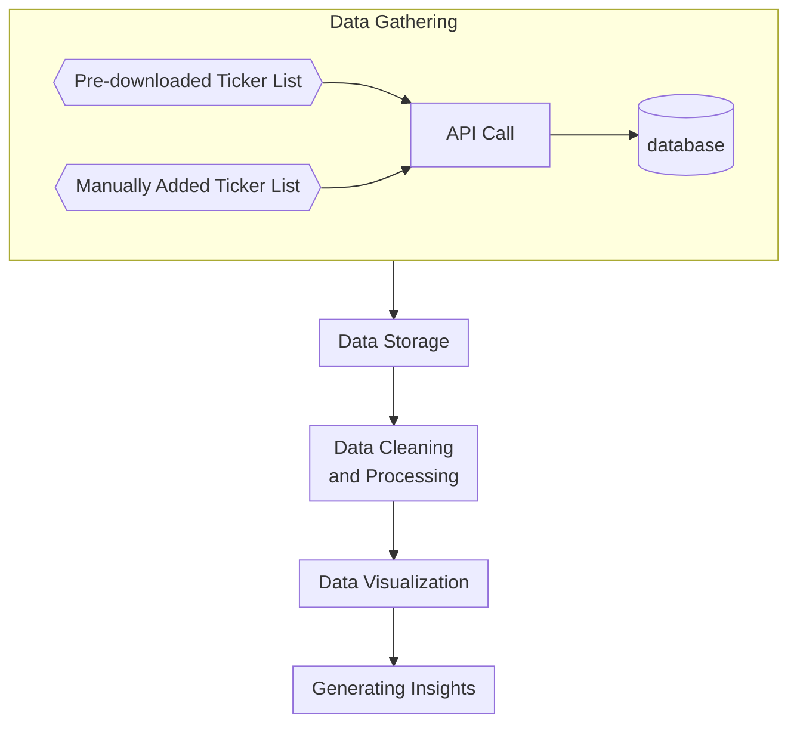

# 🌟 Finance Dashboard: Your Investment Insight Tool

Welcome to the Finance Dashboard, a web application tailored to empower investment enthusiasts by providing financial insights at their fingertips. You can visit the webapp by clicking [here](https://finance-webapp.streamlit.app/Financial_Statements).

## Table of Contents

- [🌟 Finance Dashboard: Your Investment Insight Tool](#-finance-dashboard-your-investment-insight-tool)
  - [Table of Contents](#table-of-contents)
  - [🚀 Key Highlights](#-key-highlights)
  - [💎 Features](#-features)
  - [📂 Project Structure](#-project-structure)
  - [🔧 Setup and Launch](#-setup-and-launch)
  - [🛠️ Tools and Libraries](#️-tools-and-libraries)
  - [🎯 Goal of Project](#-goal-of-project)
  - [Action Plan](#action-plan)
  - [📜 Data Acknowledgment](#-data-acknowledgment)
  - [License](#license)
  - [📝 Development Log](#-development-log)

## 🚀 Key Highlights

- **Scalable Integration**: Seamlessly fetches data from the Financial Modeling Prep API, demonstrating efficient data acquisition techniques.
- **Optimized Data Storage**: Utilizes MongoDB for structured data storage and retrieval, ensuring fast and efficient access.
- **Interactive User Interface**: Designed with Streamlit, the dashboard offers an intuitive experience with dynamic charts and metrics visualization.
- **Dynamic Financial Analysis**: Integrated DCF calculator showcases advanced financial computation capabilities.

## 💎 Features

1. **Ticker Symbol Dynamics**: Input new ticker symbols and instantly fetch their latest financial statements.
2. **Detailed Financial Data**: Delve deep into financial statements of any company, visually and analytically.
3. **Key Metrics at a Glance**: Highlighting the pivotal financial metrics for swift decision-making.
4. **Customizable Data Visualization**: Choose and toggle between different chart types for a tailored analysis experience.
5. **DCF Calculator**: A sophisticated tool that aids in understanding a company's valuation with adjustable parameters.
6. **Company Profiles**: Dive into the essence of companies with logos, descriptions, website links, and more.

## 📂 Project Structure

```
finance-dashboard/
├── .streamlit/
│   ├── config.toml
│   └── secrets.toml
├── pages/
│   ├── 1Financial_Statements.py
│   └── 2Summary.py
├── requirements.txt
├── .env
├── .gitignore
├── functions.py
├── doc.md
├── Ticket_List.py
├── LICENSE
└── README.md
```

## 🔧 Setup and Launch

1. **Get the Code**:
   ```bash
   git clone https://github.com/dizzydwarfus/finance-dashboard
   cd finance-dashboard
   ```

2. **Prepare Your Environment**:
   ```bash
   pip install -r requirements.txt
   ```

3. **MongoDB Setup**: Ensure MongoDB is active. Update `.env` with your MongoDB details.

4. **Engage with the Dashboard**:
   ```bash
   streamlit run Ticker_List.py
   ```


## 🛠️ Tools and Libraries

- **Data Processing:** Pandas
- **Web Framework:** Streamlit
- **Database:** pymongo
- **Visualization:** plotly

The main core part of the financial data obtained will be from financial APIs at the beginning to get started but will be transitioned to a self-scraped data from [Data SEC](www.sec.gov) eventually. Several open-source tools/libraries may be used when needed to aid in processing and scraping these data. These tools include but not limited to:

1. Pandas
2. Streamlit
3. pymongo
4. plotly

Streamlit will be used as the main open-source app framework for its ease of implementation. I will try to write the codebase in such a way where migration to other web-frameworks would be possible with minimal effort in the future since Streamlit has its limitation.

Plotly is chosen because it works very well with streamlit as opposed to matplotlib. Plotly also offers highly interactive figures that is much more customizable than matplotlib's.


## 🎯 Goal of Project

Besides personal stake in stock/ETF/crypto investing, I have a strong interest for finance. Though not from a Business/Finance educational background, I've self-learned many financial concepts needed to evaluate a company. Merging this knowledge with my passion for programming, I embarked on creating a financial dashboard to aid in investment decisions and to track the financial performance of my investments. While the project can be extensive, my approach is to start simple and iteratively refine and extend its capabilities.


## Action Plan

The development strategy is segmented into:

1. **Data Gathering/Extraction:** Extract data from trusted APIs.
2. **Data Storage:** Store data to a NoSQL database.
3. **Data Cleaning and Processing:** Ensure data quality and transform data as needed.
4. **Data Presentation/Visualization:** Display data in a user-friendly format.
5. **Generate Insights:** Analyze and offer valuable insights based on the data.





## 📜 Data Acknowledgment

All financial data is provided by [Financial Modeling Prep](https://financialmodelingprep.com).

## License

This project is fortified with the MIT License. Dive into the `LICENSE` file for more specifics.


## 📝 Development Log

Before 2023-05-30

1. Enabled manual update of ticker list if interested ticker symbol is not in the pre-downloaded list.
2. Use st.secrets so usernames, passwords, API-keys are stored as secrets instead of in local/cloud txt files.
3. Selectable plotly charts. Can pick and choose whichever graph to show from a list of key-graphs. 
4. Instead of directly calling API (slow), first storing information in database (<span style="color:#FF0001;">permitted as long as data not used commercially and not redistributed</span>). This is also a workaround for the limited requests per day allowed for using free version of these APIs. 
5. Introduced DCF calculator - with customizable growth, discount rates, market conditions.
6. Published on streamlit community cloud server (free)
7. Cached data whenever possible to reduce load time

| Date       | Description                                                                     |
| ---------- | ------------------------------------------------------------------------------- |
| 2023-05-30 | Created the doc.md file. Previously completed work is briefly documented above. |
